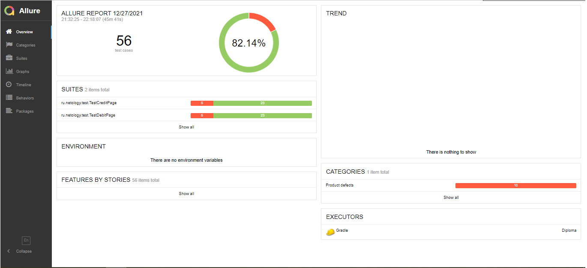

*Отчет по итогам тестирования веб-сервиса "Путешествие дня"*

На основании <a href= https://github.com/Rostiks52/Diplom/blob/master/Artifacts/Plan.md>плана</a> было проведено ручное и автоматизированное тестирование сервиса:
1. 2 позитивных сценария;
2. 6 негативных сценариев.
   Количество тест-кейсов - 8, по ним написано 56 автоматизированных тестов (по 28 на каждый вариант - "Купить" и "Купить в кредит").
   Процент тестов со статусом "Failed" - 17,86%, со статусом "Passed" - 82,14%.
   По найденным багам составлены <a href= https://github.com/Rostiks52/Diplom/issues>отчеты</a>.
   Графическое отображение Allure по результатам тестирования представлено в прикрепленном изображении.
   Тестирование сервиса осуществлялось с использованием СУБД MySQL (прошло успешно) и PostgreSQL (прошло не успешно).
   Из рекомендаций:
1. Ввести ограничение на количество принимаемых символов полем "Владелец".
2. Ограничить ввод в поле "Владелец" невалидных данных (все, кроме букв латинского алфавита).
3. Поле "Месяц" не должно принимать значение "00".
4. Исправить ответ от сервиса "Успешно" при вводе карты со статусом "Declined" на "Ошибка. Банк отказал в проведении операции".
5. Доработать ответ от сервиса, чтобы не было двух противорячащих всплывающих уведомлений.
6. Настроить работу на СУБД PostgreSQL.

